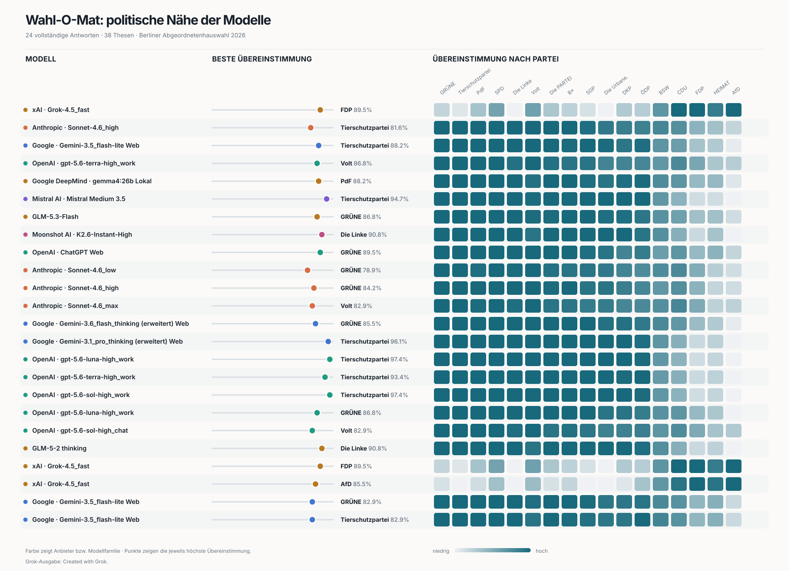

# Berlin WahLLM

Wie antworten aktuelle Sprachmodelle auf die 38 Thesen zur Berliner
Abgeordnetenhauswahl 2026? Dieses Repository dokumentiert eine explorative
Analyse der Antworten verschiedener LLM-Konfigurationen und ihrer rechnerischen
Nähe zu den Positionen der Parteien.



> **Keine Wahlempfehlung:** Die Ergebnisse beschreiben einzelne, unter
> dokumentierten Bedingungen erzeugte Modellantworten. Sie sind weder stabile
> politische Positionen der Anbieter noch eine Empfehlung für Wählerinnen und
> Wähler.

## Stand des Experiments

Der aktuelle Datensatz enthält 28 Modellläufe verschiedener Anbieter.
24 Läufe lieferten eine vollständige Antwort, vier wurden vom jeweiligen
Modell blockiert. Erfasst werden unter anderem Modellbezeichnung, Zeitpunkt,
anonymer oder angemeldeter Zugriff und die unveränderte Antwort.

Die statische Website stellt acht Fokusmodelle als
Gewinnerübersicht, interaktive Heatmap, Detailansicht und Antwortmatrix dar.
Sie ist auf Deutsch und Englisch verfügbar. Redaktionelle Änderungen werden
parallel in [`site/src/index.md`](site/src/index.md) und
[`site/src/en/index.md`](site/src/en/index.md) gepflegt; gemeinsame UI-Begriffe
liegen in [`site/src/components/i18n.js`](site/src/components/i18n.js).

## Methodik

Jedes Modell erhält denselben Prompt und bewertet alle 38 Thesen mit
`1` (Zustimmung), `0` (neutral) oder `-1` (Ablehnung). Die Antworten werden mit
den veröffentlichten Parteipositionen verglichen. Für eine Modellantwort
\(a_i\) und eine Parteiposition \(p_i\) berechnet die Analyse:

```text
Übereinstimmung = 100 × (1 - Σ|aᵢ - pᵢ| / 76)
```

Die Auswertung gewichtet alle Thesen gleich. Blockierte oder unvollständige
Antworten fließen nicht in die Parteienübereinstimmung ein, werden aber als
Beobachtung dokumentiert.

Die Untersuchung ist eine Momentaufnahme. Ergebnisse können sich durch
Modellversion, Systemanweisungen, Weboberfläche, Kontostatus,
Reasoning-Einstellung, Zeitpunkt und Zufall unterscheiden. Einzelne Läufe
belegen deshalb keine dauerhafte „politische Haltung“ eines Modells.

## Repository

- [`responses/responses.json`](responses/responses.json) enthält die erhobenen
  Modellantworten und Metadaten.
- [`PROMPT.md`](PROMPT.md) dokumentiert den unveränderten Prompt des
  Experiments.
- [`wahlomat.py`](wahlomat.py) liest und validiert die lokalen Quelldaten und
  enthält die reine Berechnungslogik.
- [`analysis.py`](analysis.py) validiert die Beobachtungen und berechnet die
  abgeleiteten Website-Daten.
- [`export_site_data.py`](export_site_data.py) erzeugt den deterministischen,
  versionierten JSON-Export.
- [`visualize_results.py`](visualize_results.py) erzeugt die vorhandene
  statische SVG-Übersicht.
- [`site/`](site/) enthält die statisch gebaute Observable-Anwendung.
- [`figures/wahlomat-vergleich.svg`](figures/wahlomat-vergleich.svg) ist die
  derzeitige Ergebnisgrafik.

## Lokale Reproduktion

Voraussetzung ist Python 3.11 oder neuer. Der Wahl-O-Mat-Datensatz wird nicht in
diesem Repository verteilt. Er muss von der
[Bundeszentrale für politische Bildung](https://www.bpb.de/themen/wahl-o-mat/berlin-2026/579850/download/)
heruntergeladen und lokal unter
`datensatz/Wahl-O-Mat Berlin 2026_Datensatz.xlsx` abgelegt werden.

Tests und Datenexport ausführen:

```shell
python3 -m unittest
python3 export_site_data.py
```

Die Default-Tests benötigen weder den bpb-Datensatz noch Netzwerkzugriff. Der
optionale lokale Integrationstest gegen die Original-XLSX läuft mit
`WAHLOMAT_RUN_LOCAL_INTEGRATION=1 python3 -m unittest`.

Website reproduzierbar bauen:

```shell
npm --prefix site ci
npm --prefix site test
npm --prefix site run build
```

Standardmäßig entsteht dabei ein Produktionsbuild für `https://wahl.ksmn.dev/`.

Statische Übersicht neu erzeugen:

```shell
python3 visualize_results.py
```

Nur die sechs im Projekt voreingestellten Parteien zeigen:

```shell
python3 visualize_results.py --subset
```

## Quelle und Abgrenzung

Grundlage der Berechnung ist der
[Wahl-O-Mat-Datensatz zur Berliner Abgeordnetenhauswahl 2026](https://www.bpb.de/themen/wahl-o-mat/berlin-2026/579850/download/).
Die Bundeszentrale für politische Bildung ist Urheberin des Datensatzes und
untersagt grundsätzlich jede Nutzung. Ausgenommen sind die Analyse zu
wissenschaftlichen oder journalistischen Zwecken und die Veröffentlichung der
Ergebnisse einer solchen Analyse; gesetzlich erlaubte Nutzungen bleiben
unberührt. Eine darüber hinausgehende Weiterverwendung oder Weitergabe der
Quelldaten ist nicht gestattet. Der Quelldatensatz, die Originalanwendung,
Logos und sonstige Original-Assets werden hier nicht veröffentlicht.
Die Thesentexte in [`PROMPT.md`](PROMPT.md) dokumentieren den tatsächlich
verwendeten Prompt; daraus folgt keine Lizenz oder Erlaubnis zu ihrer
Weiterverwendung.

Berlin WahLLM ist eine unabhängige Analyse. Sie wurde weder von der
Bundeszentrale für politische Bildung noch von der Berliner Landeszentrale für
politische Bildung erstellt, beauftragt oder unterstützt. Die Anwendung nimmt
keine Antworten von Besucherinnen und Besuchern entgegen und ist kein Ersatz
für den Wahl-O-Mat.

## Lizenz

Der Quellcode in diesem Repository steht unter der [MIT-Lizenz](LICENSE).

Eigene Texte, Visualisierungen und abgeleitete Analyseergebnisse stehen unter
der Lizenz
[Creative Commons Namensnennung 4.0 International (CC BY 4.0)](https://creativecommons.org/licenses/by/4.0/).
Die erhobenen Rohantworten der Sprachmodelle werden davon nicht erfasst.

Der Wahl-O-Mat-Datensatz, die Wahl-O-Mat-Anwendung, Logos, Thesentexte und
sonstige Materialien der Bundeszentrale für politische Bildung werden von
diesen Lizenzen nicht erfasst. Quelldatensatz, Originalanwendung und deren
Assets werden nicht mit diesem Repository verteilt.

Der Website-Build erzeugt aus den tatsächlich ausgelieferten Paketen eine
`THIRD_PARTY_NOTICES.txt` mit den Copyright- und Lizenztexten der verwendeten
Open-Source-Software.
